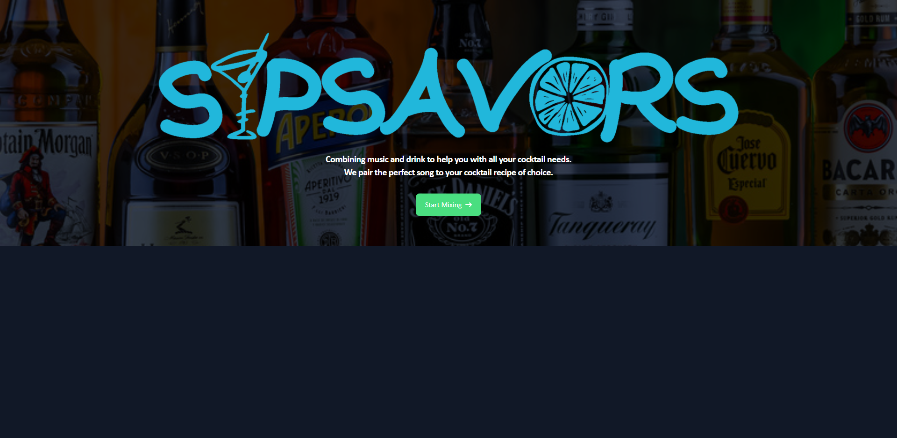
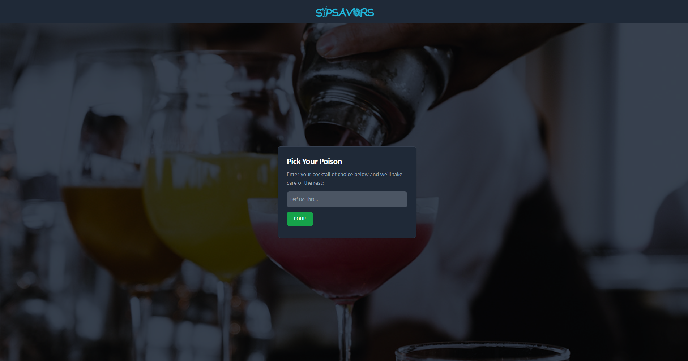
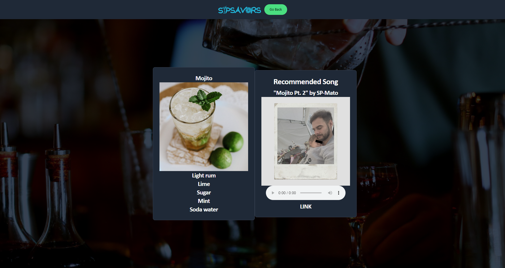

# SipSavors

## Description
Combining music and drink SipSavors provides you with a tool to help pair music to the cocktail of your choice. 
Using CocktailDB and the Spotify API SipSavors takes the user's imput and retrieves a song for you to enjoy while you're enjoying your libations.

## Screenshots

## Deployed Site

https://yanalejandro.github.io/SIP_SAVORS/